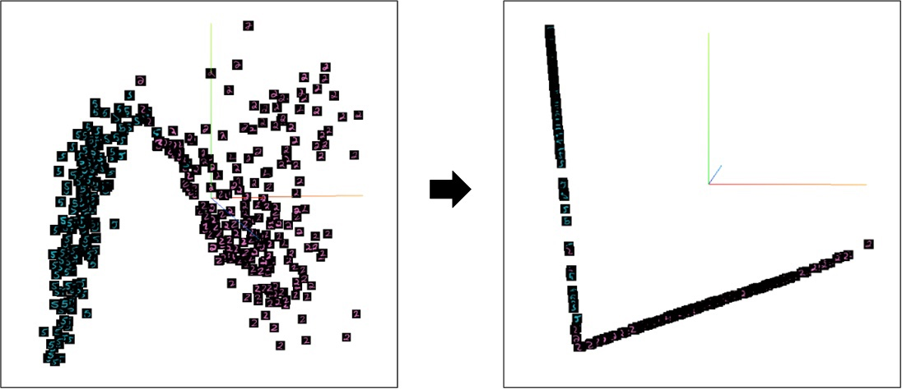

# virtual_softmax

PyTorch implementation of "Virtual Class Enhanced Discriminative Embedding Learning" (NIPS 2018).

[[paper]](https://proceedings.neurips.cc/paper/2018/file/d79aac075930c83c2f1e369a511148fe-Paper.pdf) [[tensorflow]](https://github.com/taekwan-lee/Virtual-Softmax-TF)

The effect of virtual softmax is shown in the figure below:

